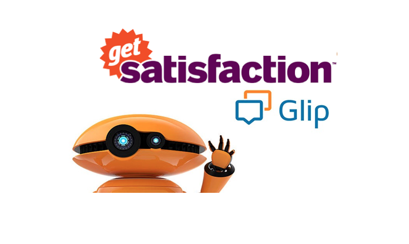
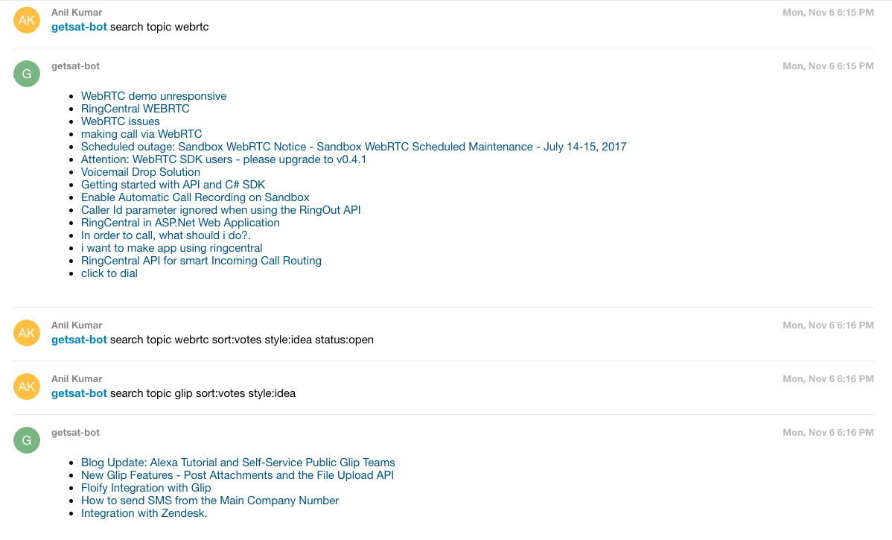

# RingCentral DevCommunity Bot



[Botman](https://botman.io) Get Satisfaction handler script to query topics by company.
 
 
## Requirement

 - PHP 5.5+ 
 - CURL extension
 - MCrypt extension
 
Note: for PHP v 5.6 you would need to comment the below line in the `php.ini` file.  
"always_populate_raw_post_data = -1" 

## Installation & Setup

### Via Github Repo ( recommended )
```php
$ git clone https://github.com/anilkumarbp/botman-getsatisfaction.git
$ cd botman-getsatisfaction
$ curl -sS https://getcomposer.org/installer | php
$ composer install
```


## Configure your Bot

### Provide Bot User details in `.env` file:

```php
$ vi .env
```


Edit the .env file and copy the below and edit app details and user details.

```php
    GLIP_SERVER=https://platform.devtest.ringcentral.com        // Server Url ( Production: https://platform.ringcentral.com || Sandbox: https://platform.devtest.ringcentral.com )
    GLIP_APPKEY=                                                // ClientId
    GLIP_APPSECRET=                                             // Client Secret
    GLIP_REDIRECT_URL=                                          // Glip Redirect URL as created above
    GLIP_WEBHOOK_URL=                                           // Glip Webhook URL
    GLIP_BOT_NAME=                                              // Glip Bot Name
```


## Usage

### Commands

We adress the bot using an `@mention` : ex: `@devcommunity-bot`

```
@devcommunity-bot:search topic (filter) <QUERY>  - returns a list of matching topic/topics.
@devcommunity-bot:help - for more information  
```

For more information on using filters, see the next section.

### Search Topics

To search topics you can use the following topic filters which must be placed ahead of your query. For example `hubot getsat search topics sort:votes style:idea glip`.

| Filter | Values | Notes |
|--------|--------|-------|
| `sort` | `votes, newest, active, replies, unanswered` | `votes` is an alias for `most_me_toos` |
| `style` | `question, problem, praise, idea, update` | |

More information on filters is available here: [https://education.getsatisfaction.com/reference-guide/api/api-resources/](https://education.getsatisfaction.com/reference-guide/api/api-resources/).

### Example Usage

The following example uses the [`botman-glip` adapter for @mentions](https://github.com/ringcentral/glip-botman/tree/%40mentions).

The `Bot` would be reqistered using the [Bot-Provisioner](https://github.com/ringcentral/glip-botman/tree/%40mentions#register-the-bot--bot-provisioning-) methodology 

```bash
@devcommunity-bot:search topic webRTC
@devcommunity-bot:search topic glip sort:votes style:idea
@devcommunity-bot:help
```



## Links

Project Repo

* https://github.com/anilkumarbp/botman-getsatisfaction

RingCentral SDK for PHP

* https://github.com/ringcentral/ringcentral-php

RingCentral API Docs

* https://developer.ringcentral.com/api-and-docs.html

RingCentral API Explorer

* https://developer.ringcentral.com/api-explorer/latest/index.html

## Contributions

Any reports of problems, comments or suggestions are most welcome.

Please report these on [botman-getsatisfaction's Issue Tracker in Github](https://github.com/anilkumarbp/botman-getsatisfaction/issues).

## License

RingCentral SDK is available under an MIT-style license. See [LICENSE.txt](LICENSE.txt) for details.

RingCentral SDK &copy; 2017 by RingCentral

## FAQ

* What if I do not have a RingCentral account? Don't have an account, no worries: [Become a RingCentral Customer](https://www.ringcentral.com/office/plansandpricing.html)
* I/My company is an Independent Software Vendor (ISV) who would like to integrate with RingCentral, how do I do that? You can apply to [Join the RingCentral Partner Program](http://www.ringcentral.com/partner/isvreseller.html)


